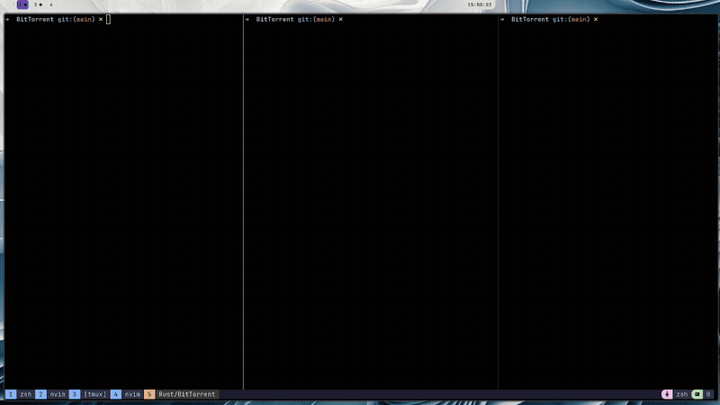
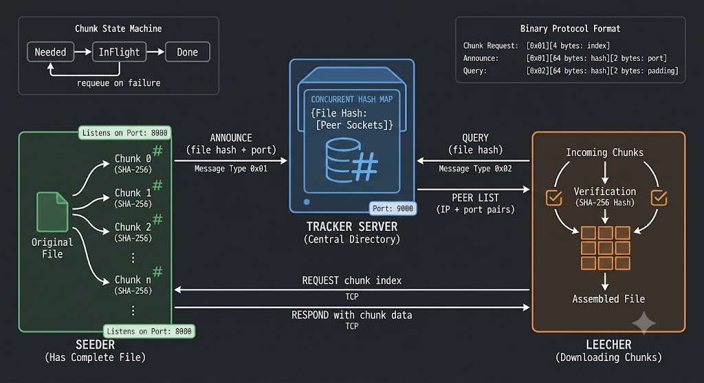

# bittorrent-rs

## Demo



A BitTorrent-style P2P file transfer client built from scratch in Rust. No protocol libraries — raw TCP sockets, a custom binary protocol, SHA-256 chunk verification, a peer tracker, and concurrent multi-peer downloading.

Built as a Rust learning project covering async networking, systems concurrency, and P2P architecture.

---

## Architecture



---

## How it works

    1. Chunk the file — Run cargo run --bin client (no args). This reads message.txt, splits it into 256-byte chunks, writes each as message.chunk0, message.chunk1, etc., and creates message.manifest.json with all the SHA-256 hashes.
   2. Start the tracker — cargo run --bin tracker. It just sits there holding a DashMap<file_hash, Vec<SocketAddr>> waiting for announcements and queries.
  3. Start the seeder — cargo run --bin client -- seed. The seeder:
    - Loads the manifest and all chunk files into memory
    - Announces itself to the tracker ("hey, I have this file, I'm on port 8080")
    - Listens on port 8080 and waits for leechers to connect to it
  4. Run the leecher — cargo run --bin client -- leech. The leecher:
    - Reads the manifest (it needs it too — it has the hashes)
    - Queries the tracker — "who has this file?"
    - Gets back a list of peer addresses
    - Connects to the seeder(s) and pulls chunks from them (the leecher requests specific chunks, the seeder responds)
    - Verifies each chunk's SHA-256 hash
    - Reassembles the file
    Simple words: Tracker has all the peers, seeder has the chunks, it announces to the tracker that it has the chunks, tracker stores the info, leecher queries the tracker to who has the chunks and the peer list, pulls specific chunks from seeder and verifies and reassembles the file.

### Chunking
A file is split into 256-byte chunks. Each chunk is SHA-256 hashed. The hashes and file metadata are saved to a `manifest.json` file that both seeder and leecher use as the source of truth.

### Protocol
Custom binary protocol over TCP:

| Message | Format |
|---|---|
| Chunk request | `[0x01][4 bytes: chunk index]` |
| Announce to tracker | `[0x01][64 bytes: file hash][2 bytes: port]` |
| Query tracker | `[0x02][64 bytes: file hash][2 bytes: padding]` |
| Chunk response | `[4 bytes: length][N bytes: data]` |
| Tracker response | `[4 bytes: peer count][N * 6 bytes: IP + port]` |

### Concurrent downloading
The leecher spawns one `tokio` task per peer. Tasks share a `PieceManager` behind an `Arc<Mutex<>>` which tracks each chunk as `Needed → InFlight → Done`. Tasks pull work dynamically — no static chunk assignment. If a peer fails mid-transfer, its in-flight chunk is requeued and another peer can pick it up.

---

## Running it

Requires three terminals. Always start the tracker first.

**Terminal 1 — start the tracker**
```bash
cargo run --bin tracker
or 
make tracker
```

**Terminal 2 — chunk the file and start the seeder**
```bash
cargo run --bin client
or 
make run

cargo run --bin client -- seed
or 
make seeder
```

**Terminal 3 — run the leecher**
```bash
cargo run --bin client -- leech
or 
make leecher
```

Verify the output matches the original:
```bash
diff message.txt <reassembled_file>
```

To test with a larger file:
```bash
dd if=/dev/urandom bs=1M count=5 of=message.txt
cargo run --bin client
```

---

## Project structure

```
src/
├── main.rs              # CLI entrypoint (chunk / seed / leech)
├── lib.rs               # Seeder, leecher, networking, manifest, reassembly
├── piece_manager/
│   └── manager.rs       # PieceManager — chunk state machine
└── bin/
    └── tracker.rs       # Standalone tracker binary
```

---

## Crates used

| Crate | Purpose |
|---|---|
| `tokio` | Async runtime, TCP sockets, task spawning |
| `sha2` | SHA-256 chunk hashing |
| `serde` + `serde_json` | Manifest serialization |
| `dashmap` | Concurrent HashMap for tracker peer registry |
| `indicatif` | Download progress bar |

---
## Limitations

- Only supports IPv4 peers
- No peer discovery beyond tracker (no DHT)
- No upload throttling or rate control
- Single-file transfers only
- No persistence of peer state
